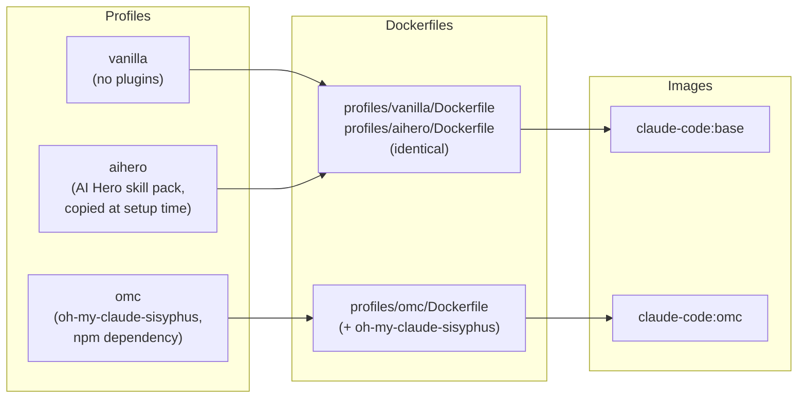
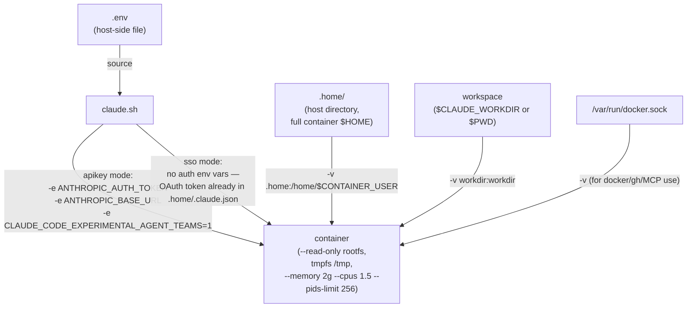

# Architecture

Companion to [CLAUDE.md](../CLAUDE.md). Two diagrams: how a profile maps to a Docker image, and
how a credential gets from `.env` into a running container.

## Profile / image build matrix

Three profiles, two images. `omc` needs an extra npm package baked in, so it gets its own image;
`vanilla` and `aihero` are otherwise-identical Claude Code installs and share one.

`aihero`'s skill pack isn't a system dependency — `setup.sh` clones `mattpocock/skills` and copies
files into `.home/.claude/skills/` after the (shared) image is already built. That's why it shares
`claude-code:base` instead of getting a third image.

## `.home/` mount + auth injection

A checkout is locked to one profile (`.claude-profile`) and has its own `.env` and `.home/`. Every
`claude.sh` invocation reads `.env`, then passes credentials and mounts to `docker run` as flags —
never through `settings.json` inside the container.

Two credential paths, never crossed (see [CLAUDE.md](../CLAUDE.md#credential-placement)):

- **`apikey`** — secret lives in `.env` (host-readable by anyone with checkout access), injected
  as `ANTHROPIC_AUTH_TOKEN` at `docker run` time. Never written into `.home/`.
- **`sso`** — secret lives in `.home/.claude.json`, written by Claude Code's own OAuth login the
  first time it runs inside the container. Never written into `.env`.

The `--read-only` rootfs + tmpfs `/tmp` means anything the container writes outside `.home/`, the
workdir, or `/tmp` fails immediately instead of landing somewhere unmounted and un-audited.
